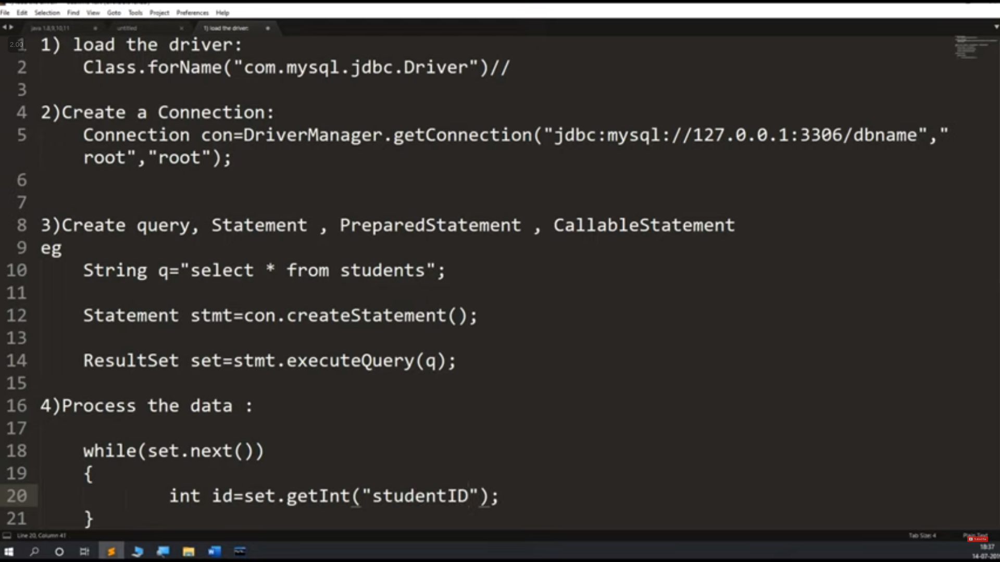
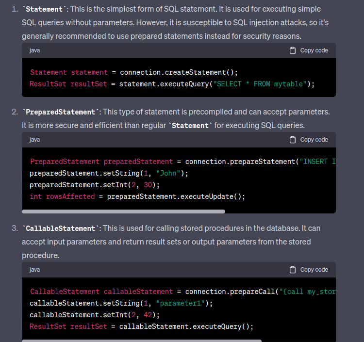
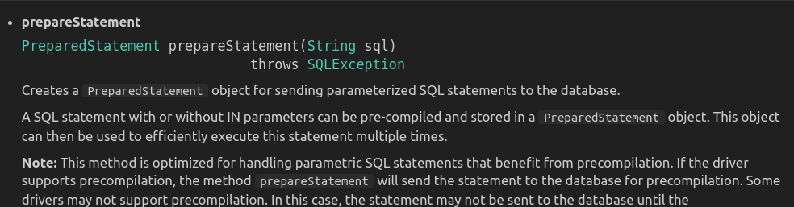

# JDBC Connection Guide



  

# Statement
```java
Statement statement = connection.createStatement();
ResultSet resultSet = statement.executeQuery("SELECT * FROM mytable");

```


# PreparedStatement
```java
PreparedStatement preparedStatement = connection.prepareStatement("INSERT INTO mytable (name, age) VALUES (?, ?)");
preparedStatement.setString(1, "John");
preparedStatement.setInt(2, 30);
int rowsAffected = preparedStatement.executeUpdate();
```

# CallableStatement

```java
CallableStatement callableStatement = connection.prepareCall("{call my_stored_procedure(?, ?)}");
callableStatement.setString(1, "parameter1");
callableStatement.setInt(2, 42);
ResultSet resultSet = callableStatement.executeQuery();

```

### In PreparedStatement we need to pass the query that time only , not like Statement 


# :star:Remember this :star:
 ```java 
 PreparedStatement ptmt = con.prepareStatement(q);
 ```